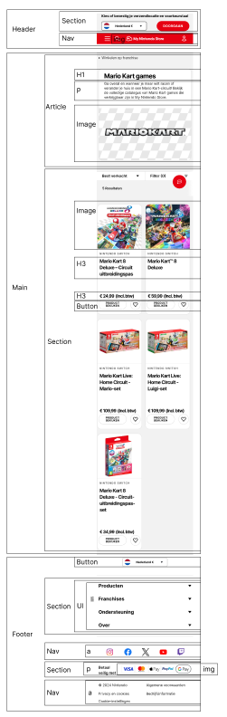

# Procesverslag
Markdown is een simpele manier om HTML te schrijven.  
Markdown cheat cheet: [Hulp bij het schrijven van Markdown](https://github.com/adam-p/markdown-here/wiki/Markdown-Cheatsheet).

Nb. De standaardstructuur en de spartaanse opmaak van de README.md zijn helemaal prima. Het gaat om de inhoud van je procesverslag. Besteedt de tijd voor pracht en praal aan je website.

Nb. Door *open* toe te voegen aan een *details* element kun je deze standaard open zetten. Fijn om dat steeds voor de relevante stuk(ken) te doen.

## Jij

  
uitwerken voor kick-off werkgroep

  ### Auteur:
  Mart Roskam

  #### Je startniveau:
  Blauw en misschien rood als blauw te makkelijk is

  #### Je focus:
  Surface plane
 

## Je website

  
uitwerken voor kick-off werkgroep

  ### Je opdracht:
  https://store.nintendo.nl/nl/games/shop-by-franchise/mario-kart-games?sort=top-sellers en https://store.nintendo.nl/nl/mario-kart-8-deluxe-70010000000126

  #### Screenshot(s) van de eerste pagina (small screen): 
  Mario Kart games overzicht op de nintendo store
  

  #### Screenshot(s) van de tweede pagina (small screen):
  Mario Kart 8 Deluxe op de nintendo store
  
 

## Toegankelijkheidstest 1/2 (week 1)

  
uitwerken na test in 2e werkgroep

  ### Bevindingen
  Na het volgen van de WCAG Checklist kwamen ik deze dingen tegen die beter kunnen:
  1. Bij buttons is het niet altijd duidelijk wat ze doen voordat je er op klikt
  2. Verschrikkelijk sleche focus style (behalve in de footer)
  3. Headings zjn niet echt op een logische volgorde (eerst h3 dan h2?)
  4. Meeste alt tags of aria labels zijn goed, maar een aantal kunnen toch wat gebruiksvriendelijker
  5. Subtitles zijn niet available maar zijn ook niet persee nodig bij deze video
  6. Wanneer ik de video pauzeer verdwijnt die en moet ik opnieuw beginnen?
  7. Site heeft geen darkmode (alleen lightmode)

## Breakdownschets (week 1)

  
uitwerken na afloop 3e werkgroep

  ### Eerste pagina (overzicht mario kart games): 
  

  ### Tweede pagina (Mario Kart 8 Deluxe kooppagina): 
  

## Voortgang 1 (week 2)

  
uitwerken voor 1e voortgang

  ### Stand van zaken
  Ik loop een beetje achter en vind het ook best een lastige en overweldigende opdracht, maar ik hoop dit weekend bij te komen en dat ik daarna verder kan werken.

  ### Agenda voor meeting
  samen met je groepje opstellen

  | Mart Roskam                     
  | 
  | Vragen die ik wil stellen:            
  | 1. Wanneer gebruik je een div / section / article?      
  | 2. Waarom is de javascript gelinkt in de body?
  | 3. Mag je buttons gebruiken in je html?
  | 4. Hoe specifiek moet je zijn met alt-tags?

  ### Verslag van meeting
  hier na afloop snel de uitkomsten van de meeting vastleggen

  - Antwoord vraag 1: Div is alleen layout wise voor css. Gebruik sections als je niet zeker weet of het een article is.
  - Antwoord vraag 2: Dat hoort zo, want dan wordt eerst je html en css geladen en daarna pas je javascript. Dit helpt goed voor asl je javascript vastloopt 
  - Antwoord vraag 3: Gebruik a links wanneer de link van de website veranderd en gebruik buttons voor interacties op dezelfde pagina
  - Antwoord vraag 4: Zo als ik het nu doe is wel prima

  Ik kreeg feedback van studentassistenten over mijn HTML pagina en ik heb goed antwoord op mijn vragen gekregen. 
  Details tag gebruiken in de footer

## Voortgang 2 (week 3)

  
uitwerken voor 2e voortgang

  ### Stand van zaken
  Ik loop nogsteeds achter maar ik begin wel in de flow te komen

  ### Agenda voor meeting
  samen met je groepje opstellen

  | Mart Roskam     
  | ---             
  | Vragen die ik wil stellen:   
  | 1. Ik krijg allemaal info's over dat mijn sections geen headings hebben, moet ik ze dan naar divs veranderen zoals de validator zegt?
  | 2. Wat is slim om te doen als ik meerdere html pagina's in dezelfde css pagina moet stylen?

  ### Verslag van meeting
  hier na afloop snel de uitkomsten van de meeting vastleggen

  - Antwoorden op mijn vragen:
  - 1. Sections moeten eigenlijk wel altijd headings hebben dus gebruik ipv sections dan divs
  - 2. Maak gebruik van classes of zorg ervoor dat de pagina's er ongeveer hetzelfde uitzien (ook goed voor toegankelijkheid)

  Feedback van ivo over mijn code en readme:
  - Doe de toegankelijksheidtest opnieuw (Done)
  - Zet je bronnen in je readme (Done)
  - Maak je alt tags toegankelijker (Done)
  - Verminder je aantal sections 
  - Fix de hierarchie in je headings (Done)
  - Maak van de images in je nav een a href (Done)

## Toegankelijkheidstest 2/2 (week 4)

  
uitwerken na test in 9e werkgroep

  ### Bevindingen
  Lijst met je bevindingen die in de test naar voren kwamen (geef ook aan wat er verbeterd is):

## Voortgang 3 (week 4)

  
uitwerken voor 3e voortgang

  ### Stand van zaken
  Ik loop nogsteeds achter, maar de eerste pagina is bijna af. Dus het gaat al wel wat beter.

  ### Agenda voor meeting
  samen met je groepje opstellen

  | Mart Roskam    
  | ---            
  | Vragen die ik wil stellen:  
  | 1. Waarom werken de buttons in mijn cards niet normaal?
  | 2. Waarom staan de social media links en icons zo raar?    
  | 3. Hoe zorg ik er voor dat de links in mijn footer op deze manier komen te staan met flexbox?  

  ### Verslag van meeting
  hier na afloop snel de uitkomsten van de meeting vastleggen

  - punt 1
  - punt 2
  - nog een punt
  - ...

## Eindgesprek (week 5)

  
uitwerken voor eindgesprek

  ### Je uitkomst - karakteristiek screenshots:
  

  ### Dit ging goed/Heb ik geleerd: 
  Korte omschrijving met plaatjes

  

  ### Dit was lastig/Is niet gelukt:
  Korte omschrijving met plaatjes

  

## Bronnenlijst

  
continu bijhouden terwijl je werkt

  Nb. Wees specifiek ('css-tricks' als bron is bijv. niet specifiek genoeg). 
  Nb. ChatGpT en andere AI horen er ook bij.
  Nb. Vermeld de bronnen ook in je code.

Bronnen voor code:
  1. [bron 1](https://css-tricks.com/snippets/css/a-guide-to-flexbox/)
  2. bron 2
  3. ...

Bronnen voor images:
  1. https://store.nintendo.nl/nl/games/shop-by-franchise/mario-kart-games?sort=top-sellers 
  2. https://www.nintendo.com/en-gb/My-Nintendo-Store/Legal/Terms-of-Delivery-1361209.html 
  3.

