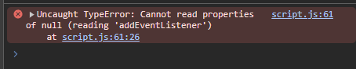

# Procesverslag
Markdown is een simpele manier om HTML te schrijven.  
Markdown cheat cheet: [Hulp bij het schrijven van Markdown](https://github.com/adam-p/markdown-here/wiki/Markdown-Cheatsheet).

Nb. De standaardstructuur en de spartaanse opmaak van de README.md zijn helemaal prima. Het gaat om de inhoud van je procesverslag. Besteedt de tijd voor pracht en praal aan je website.

Nb. Door *open* toe te voegen aan een *details* element kun je deze standaard open zetten. Fijn om dat steeds voor de relevante stuk(ken) te doen.

## Jij

  
uitwerken voor kick-off werkgroep

  ### Auteur:
  Mart Roskam

  #### Je startniveau:
  Blauw

  #### Je focus:
  Surface plane
 

## Je website

  
uitwerken voor kick-off werkgroep

  ### Je opdracht:
  https://store.nintendo.nl/nl/games/shop-by-franchise/mario-kart-games?sort=top-sellers en https://store.nintendo.nl/nl/mario-kart-8-deluxe-70010000000126

  #### Screenshot(s) van de eerste pagina (small screen): 
  Mario Kart games overzicht op de nintendo store
  

  #### Screenshot(s) van de tweede pagina (small screen):
  Mario Kart 8 Deluxe op de nintendo store
  
 

## Toegankelijkheidstest 1/2 (week 1)

  
uitwerken na test in 2e werkgroep

  ### Bevindingen
  Na het volgen van de WCAG Checklist kwamen ik deze dingen tegen die goed zijn:
  1. Er wordt geen moeilijke taal gebruikt
  2. HTMl heeft een lang attribute en titles
  3. Site kan goed meedraien zowel horizontaal als verticaal
  4. Buttons zijn niet te klein en niet te groot
  5. Er is genoeg ruimte tussen interactieve elementen
  6. Video speelt niet automatisch af
  7. De site maakt goed gebruik van buttons en a links

  Na het volgen van de WCAG Checklist kwamen ik deze dingen tegen die beter kunnen:
  1. HTML is heel chaotisch en niet semantisch
  2. Verschrikkelijk slechte focus styling (behalve in de footer)
  3. Headings zjn niet echt op een logische volgorde (eerst h3 dan h2?)
  4. Sommige alt tags zijn goed, maar de meeste beschrijven niet wat er staat of missen compleet
  5. Subtitles zijn niet available maar zijn ook niet persee nodig bij deze video
  6. Site heeft geen darkmode (alleen lightmode)
  7. Buttons en links zijn niet altijd even duidelijk met wat ze doen of waar je naartoe gestuurd wordt als je er op klinkt

## Breakdownschets (week 1)

  
uitwerken na afloop 3e werkgroep

  ### Eerste pagina (overzicht mario kart games): 
  

  ### Tweede pagina (Mario Kart 8 Deluxe kooppagina): 
  

## Voortgang 1 (week 2)

  
uitwerken voor 1e voortgang

  ### Stand van zaken
  Ik loop een beetje achter en vind het ook best een lastige en overweldigende opdracht, maar ik hoop dit weekend bij te komen en dat ik daarna verder kan werken.

  ### Agenda voor meeting
  samen met je groepje opstellen

  | Mart Roskam                     
  | 
  | Vragen die ik wil stellen:            
  | 1. Wanneer gebruik je een div / section / article?      
  | 2. Waarom is de javascript gelinkt in de body?
  | 3. Mag je buttons gebruiken in je html?
  | 4. Hoe specifiek moet je zijn met alt-tags?

  ### Verslag van meeting
  hier na afloop snel de uitkomsten van de meeting vastleggen

  - Antwoord vraag 1: Div is alleen layout wise voor css. Gebruik sections als je niet zeker weet of het een article is.
  - Antwoord vraag 2: Dat hoort zo, want dan wordt eerst je html en css geladen en daarna pas je javascript. Dit helpt goed voor asl je javascript vastloopt 
  - Antwoord vraag 3: Gebruik a links wanneer de link van de website veranderd en gebruik buttons voor interacties op dezelfde pagina
  - Antwoord vraag 4: Zo als ik het nu doe is wel prima

  Ik kreeg feedback van studentassistenten over mijn HTML pagina en ik heb goed antwoord op mijn vragen gekregen. 
  Details tag gebruiken in de footer

## Voortgang 2 (week 3)

  
uitwerken voor 2e voortgang

  ### Stand van zaken
  Ik loop nogsteeds achter maar ik begin wel in de flow te komen

  ### Agenda voor meeting
  samen met je groepje opstellen

  | Mart Roskam     
  | ---             
  | Vragen die ik wil stellen:   
  | 1. Ik krijg allemaal info's over dat mijn sections geen headings hebben, moet ik ze dan naar divs veranderen zoals de validator zegt?
  | 2. Wat is slim om te doen als ik meerdere html pagina's in dezelfde css pagina moet stylen?

  ### Verslag van meeting
  hier na afloop snel de uitkomsten van de meeting vastleggen

  - Antwoorden op mijn vragen:
  - 1. Sections moeten eigenlijk wel altijd headings hebben dus gebruik ipv sections dan divs
  - 2. Maak gebruik van classes of zorg ervoor dat de pagina's er ongeveer hetzelfde uitzien (ook goed voor toegankelijkheid)

  Feedback van ivo over mijn code en readme:
  - Doe de toegankelijksheidtest opnieuw (Done)
  - Zet je bronnen in je readme (Done)
  - Maak je alt tags toegankelijker (Done)
  - Verminder je aantal sections (Done)
  - Fix de hierarchie in je headings (Done)
  - Maak van de images in je nav een a href (Done)

## Toegankelijkheidstest 2/2 (week 4)

  
uitwerken na test in 9e werkgroep

  ### Bevindingen
  Lijst met je bevindingen die in de test naar voren kwamen (geef ook aan wat er verbeterd is):

  Ten opzichte van de vorige test heb ik deze dingen verbeterd:
  1. HTML is nu semantisch en niet meer chaotisch
  2. Focus styling is verbeterd (werkt alleen niet op de video)
  3. Headings zitten nu op een goede en logische volgerde
  4. Alles dat een alt tag moet hebben heeft er eentje, ook heb ik aria-labels toegevoegd aan buttons, links en details
  5. Darkmode is nu ook aanwezig voor de mensen die dat aan hebben staan
  6. Buttons en links zijn nu wel duidelijk waar ze heen gaan (door de aria-labels)

## Voortgang 3 (week 4)

  
uitwerken voor 3e voortgang

  ### Stand van zaken
  Ik loop nogsteeds heel erg achter, maar de eerste pagina is bijna af. Dus het gaat al wel wat beter.

  ### Agenda voor meeting
  samen met je groepje opstellen

  | Mart Roskam    
  | ---            
  | Vragen die ik wil stellen:  
  | 1. Waarom werken de buttons in mijn cards niet normaal?
  | 2. Waarom staan de social media links en icons zo raar?    
  | 3. Hoe zorg ik er voor dat de links in mijn footer op deze manier komen te staan met flexbox?  

  ### Verslag van meeting
  hier na afloop snel de uitkomsten van de meeting vastleggen

Antwoorden op mijn vragen:
1. Heb ze nu van flexbox veranderd naar grid waardoor ze de volle ruimte inemene
2. Omdat er standaard een padding om een ul staat moest ik deze op 0 zetten
3. Tip van David: Twee divjes en dan op de grote container flex direction row en op de twee divjes flex column

## Eindgesprek (week 5)

  
uitwerken voor eindgesprek

  ### Je uitkomst - karakteristiek screenshots:
  
  

  ### Dit ging goed/Heb ik geleerd: 
  1. Hoe een details tag werkt
  2. Hoe ik grid moet gebruiken
  3. Hoe ik een video moet toevoegen aan mijn website
  4. Hoe ik kan stylen zonder al te veel classes te gebruiken
  5. Wat een aria-label is en waar dat goed voor is
  6. Hoe je kleuren in je :root kan zetten en daarna gebruiken
  7. Wat media quieries zijn en hoe je die kan toepassen
  8. Hoe ik toegankelijkheid van websites kan verbeteren en testen
  9. Hoe je elementen kan laten verdwijnen met een klik op een knop

  

  ### Dit was lastig/Is niet gelukt:
  1. Ik liep veel achter en heb eigenlijk 80% van de website in de laatste week moeten maken
  2. Mijn hamburgermenu doet het niet, ookal heb ik heel veel geprobeerd
  3. Ik kreeg het niet voor elkaar om een focus state op de video te zetten
  4. Niet alle buttons werken ook echt (door tijdsdruk)
  5. Er zit een error in mijn console die ik maar niet wegkrijg
  6. Mijn darkmode had wat beter gekunt

  
  
  

## Bronnenlijst

  
continu bijhouden terwijl je werkt

  Nb. Wees specifiek ('css-tricks' als bron is bijv. niet specifiek genoeg). 
  Nb. ChatGpT en andere AI horen er ook bij.
  Nb. Vermeld de bronnen ook in je code.

Bronnen voor code:
  1. [ChatGPT] https://chatgpt.com/share/66f921a3-29e8-8004-a5a0-6ed1532b01dc Prompt: Hoe zorg ik er voor dat wanneer ik op de eerste button in de header klik een p tag met daarin Meer opties.... tevoorschijn komt als een soort box onder de knop.
  2. [ChatGPT] https://chatgpt.com/share/66f99e85-a728-8004-856a-b1b61eac2103 Prompt: Hoe maak ik een hamburger menu die opent in een popup wanneer je op de hamburgericon klikt? 
  3. [ChatGPT] https://chatgpt.com/share/66fb1adc-3ee4-8004-a090-85899c6dbf02 Prompt: Hoe zorg ik er voor dat wanneer deze details tag geopend worden de source van de images in de summary veranderen naar images/detailsmin.svg
  4. [Css-Tricks Flexbox] https://css-tricks.com/snippets/css/a-guide-to-flexbox/
  5. [Css-Tricks Grid] https://css-tricks.com/snippets/css/complete-guide-grid/ 

Bronnen voor images en videos:
  1. https://store.nintendo.nl/nl/games/shop-by-franchise/mario-kart-games?sort=top-sellers 
  2. https://store.nintendo.nl/nl/mario-kart-8-deluxe-70010000000126
  3. https://www.nintendo.com/en-gb/My-Nintendo-Store/Legal/Terms-of-Delivery-1361209.html 
  4. https://www.youtube.com/watch?v=HYEAQcHo9HA&ab_channel=NintendoNederland

